# Diagramy — HandlujZTym

Wszystkie diagramy są zapisane w formacie **Mermaid** i renderują się bezpośrednio na GitHubie oraz w większości nowoczesnych edytorów Markdown.

---

## 1. Architektura warstw

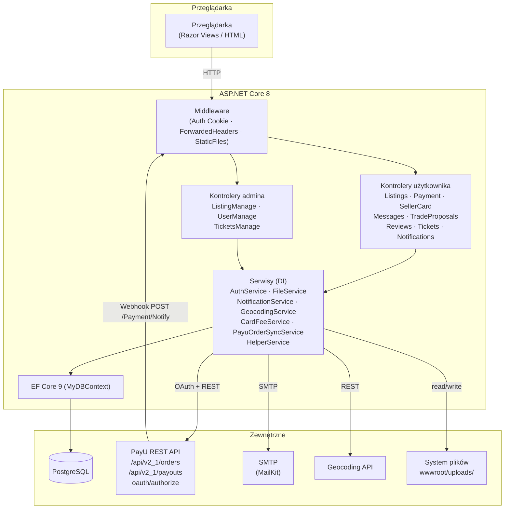
```mermaid
graph TD
    subgraph Przeglądarka
        Browser["Przeglądarka\n(Razor Views / HTML)"]
    end

    subgraph ASP.NET Core 8
        direction TB
        MW["Middleware\n(Auth Cookie · ForwardedHeaders · StaticFiles)"]
        CTRL_U["Kontrolery użytkownika\nListings · Payment · SellerCard\nMessages · TradeProposals\nReviews · Tickets · Notifications"]
        CTRL_A["Kontrolery admina\nListingManage · UserManage\nTicketsManage"]
        SVC["Serwisy (DI)\nAuthService · FileService\nNotificationService · GeocodingService\nCardFeeService · PayuOrderSyncService\nHelperService"]
        EF["EF Core 9 (MyDBContext)"]
    end

    subgraph Zewnętrzne
        PG[(PostgreSQL)]
        PAYU["PayU REST API\n/api/v2_1/orders\n/api/v2_1/payouts\noauth/authorize"]
        SMTP["SMTP\n(MailKit)"]
        GEO["Geocoding API"]
        FS["System plików\nwwwroot/uploads/"]
    end

    Browser -->|HTTP| MW
    MW --> CTRL_U
    MW --> CTRL_A
    CTRL_U --> SVC
    CTRL_A --> SVC
    SVC --> EF
    EF --> PG
    SVC -->|OAuth + REST| PAYU
    SVC -->|SMTP| SMTP
    SVC -->|REST| GEO
    SVC -->|read/write| FS
    PAYU -->|Webhook POST /Payment/Notify| MW
```

---

## 2. Diagram komponentów (DI)

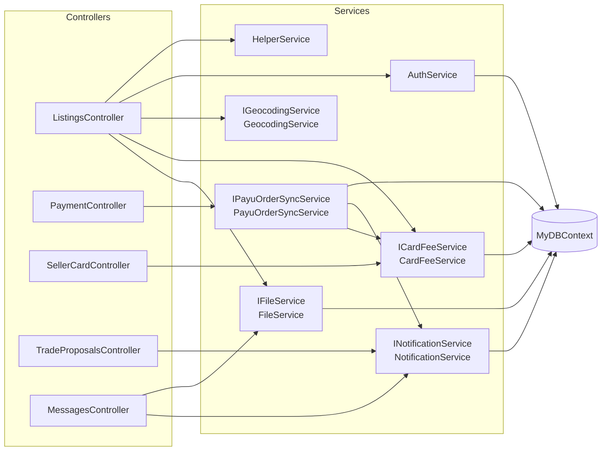
```mermaid
graph LR
    subgraph Controllers
        LC[ListingsController]
        PC[PaymentController]
        SC[SellerCardController]
        TC[TradeProposalsController]
        MC[MessagesController]
    end

    subgraph Services
        IFS[IFileService\nFileService]
        INS[INotificationService\nNotificationService]
        IGS[IGeocodingService\nGeocodingService]
        ICFS[ICardFeeService\nCardFeeService]
        IPSS[IPayuOrderSyncService\nPayuOrderSyncService]
        AS[AuthService]
        HS[HelperService]
    end

    DB[(MyDBContext)]

    LC --> IFS
    LC --> ICFS
    LC --> IGS
    LC --> AS
    LC --> HS
    PC --> IPSS
    SC --> ICFS
    TC --> INS
    MC --> INS
    MC --> IFS
    IPSS --> ICFS
    IPSS --> INS
    IFS --> DB
    INS --> DB
    ICFS --> DB
    IPSS --> DB
    AS --> DB
```

---

## 3. Diagram ERD — schemat bazy danych

```mermaid
erDiagram
    Users {
        int Id PK
        string Username
        string Email
        string FirstName
        string LastName
        string Address
        double Longitude
        double Latitude
        string PhoneNumber
        bool IsAdmin
        bool IsBanned
        bool IsDeleted
        datetime CreatedAt
    }

    UserAuths {
        int Id PK
        int UserId FK
        string Password
        string PasswordSalt
    }

    Listings {
        int Id PK
        int SellerId FK
        string Title
        string Description
        string Location
        int Type
        decimal Price
        int StockQuantity
        bool IsFeatured
        bool IsSold
        bool IsArchived
        bool NotExchangeable
        decimal MinExchangeValue
        string ExchangeDescription
        int ViewCount
        datetime CreatedAt
        datetime UpdatedAt
    }

    Tags {
        int Id PK
        string Name
    }

    ListingTags {
        int Id PK
        int ListingId FK
        int TagId FK
    }

    ListingExchangeAcceptedTags {
        int Id PK
        int ListingId FK
        int TagId FK
    }

    Uploads {
        int Id PK
        int UploaderId FK
        string FileName
        string Extension
        string Url
        long SizeBytes
        datetime UploadedAt
    }

    ListingPhotos {
        int Id PK
        int ListingId FK
        int UploadId FK
        bool IsFeatured
    }

    ListingShippingOptions {
        int Id PK
        int ListingId FK
        string Name
        decimal Price
    }

    Reviews {
        int Id PK
        int ListingId FK
        int ReviewerId FK
        int Rating
        string Description
        int Upvotes
        int Downvotes
        datetime CreatedAt
    }

    ReviewPhotos {
        int Id PK
        int ReviewId FK
        int UploadId FK
    }

    Orders {
        int Id PK
        int ListingId FK
        int BuyerId FK
        int SellerId FK
        decimal Amount
        int Quantity
        string PayUOrderId
        int Status
        string SelectedShippingName
        decimal ShippingCost
        datetime CreatedAt
        bool IsArchived
    }

    TradeProposals {
        int Id PK
        int InitiatorUserId FK
        int ReceiverUserId FK
        int SubjectListingId FK
        int Status
        int ParentTradeProposalId FK
        int RootTradeProposalId FK
        datetime CreatedAt
        datetime UpdatedAt
        datetime LastModifiedAt
    }

    TradeProposalItems {
        int Id PK
        int TradeProposalId FK
        int Side
        int ListingId FK
        int Quantity
        decimal CashAmount
        string CustomOfferTitle
        decimal CustomOfferEstimatedValue
    }

    TradeProposalHistoryEntries {
        int Id PK
        int TradeProposalId FK
        int UserId FK
        string Summary
        datetime ChangedAt
    }

    TradeOrders {
        int Id PK
        int TradeProposalId FK
        int PayerUserId FK
        int ReceiverUserId FK
        int PayerSide
        decimal CashAmount
        decimal ShippingCost
        decimal TotalAmount
        string SelectedShippingName
        string PayUOrderId
        int Status
        datetime CreatedAt
    }

    Messages {
        int Id PK
        int SenderId FK
        int ReceiverId FK
        int ListingId FK
        int TicketId FK
        int TradeProposalId FK
        int ReplyToMessageId FK
        string Content
        datetime SentAt
        bool IsRead
        bool IsArchived
    }

    MessagePhotos {
        int Id PK
        int MessageId FK
        int UploadId FK
    }

    Notifications {
        int Id PK
        int UserId FK
        int Kind
        int MessageId FK
        int OrderId FK
        int TradeProposalId FK
        bool IsRead
        datetime CreatedAt
    }

    Tickets {
        int Id PK
        int UserId FK
        int AssigneeId FK
        int Category
        int Status
        string Subject
        string Description
        int ReportedUserId FK
        int ReportedListingId FK
        bool IsArchived
        datetime CreatedAt
        datetime LastActivity
    }

    TicketAttachments {
        int Id PK
        int TicketId FK
        int UploadId FK
    }

    SellerCards {
        int Id PK
        int UserId FK
        string PayUCardToken
        string MaskedNumber
        string Brand
        int ExpiryMonth
        int ExpiryYear
        bool IsActive
        datetime CreatedAt
    }

    SellerPayouts {
        int Id PK
        int SellerId FK
        int OrderId FK
        decimal GrossAmount
        decimal CommissionAmount
        decimal NetAmount
        int Status
        string PayUPayoutId
        string ErrorMessage
        datetime CreatedAt
        datetime ProcessedAt
    }

    CardTokenizationOrders {
        int Id PK
        int UserId FK
        string PayUOrderId
        bool Completed
        datetime CreatedAt
    }

    Users ||--o{ UserAuths : "ma"
    Users ||--o{ Listings : "wystawia"
    Users ||--o{ Reviews : "pisze"
    Users ||--o{ Messages : "wysyła"
    Users ||--o{ Messages : "odbiera"
    Users ||--o{ TradeProposals : "inicjuje"
    Users ||--o{ TradeProposals : "odbiera"
    Users ||--o{ Notifications : "otrzymuje"
    Users ||--o{ Tickets : "zgłasza"
    Users ||--o{ SellerCards : "posiada"
    Users ||--o{ SellerPayouts : "otrzymuje"
    Users ||--o{ CardTokenizationOrders : "inicjuje"

    Listings ||--o{ ListingTags : "ma"
    Listings ||--o{ ListingExchangeAcceptedTags : "akceptuje tagi"
    Listings ||--o{ ListingPhotos : "ma"
    Listings ||--o{ ListingShippingOptions : "ma"
    Listings ||--o{ Reviews : "posiada"
    Listings ||--o{ Orders : "dotyczy"
    Listings ||--o{ TradeProposals : "jest przedmiotem"
    Listings ||--o{ TradeProposalItems : "jest elementem"

    Tags ||--o{ ListingTags : "używany"
    Tags ||--o{ ListingExchangeAcceptedTags : "akceptowany"

    Uploads ||--o{ ListingPhotos : "w"
    Uploads ||--o{ ReviewPhotos : "w"
    Uploads ||--o{ MessagePhotos : "w"
    Uploads ||--o{ TicketAttachments : "w"

    Reviews ||--o{ ReviewPhotos : "ma"

    Orders ||--o{ SellerPayouts : "generuje"

    TradeProposals ||--o{ TradeProposalItems : "zawiera"
    TradeProposals ||--o{ TradeProposalHistoryEntries : "historia"
    TradeProposals ||--o{ TradeOrders : "generuje"
    TradeProposals ||--o{ Messages : "powiązana"
    TradeProposals ||--o{ TradeProposals : "kontrferta"

    Messages ||--o{ MessagePhotos : "ma"
    Messages ||--o{ Messages : "odpowiedź"

    Tickets ||--o{ TicketAttachments : "ma"
```

---

## 4. Diagram klas — kluczowe encje domenowe

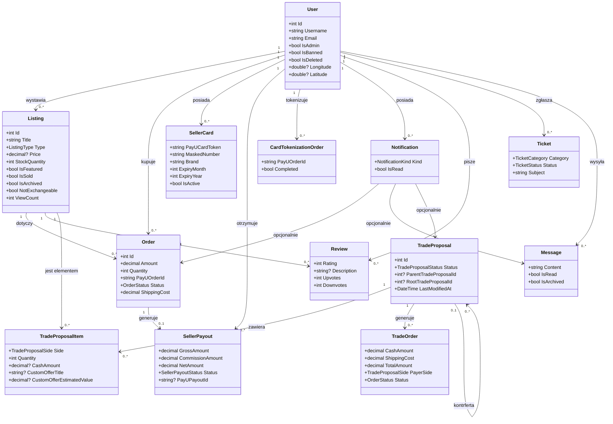
```mermaid
classDiagram
    class User {
        +int Id
        +string Username
        +string Email
        +bool IsAdmin
        +bool IsBanned
        +bool IsDeleted
        +double? Longitude
        +double? Latitude
    }

    class Listing {
        +int Id
        +string Title
        +ListingType Type
        +decimal? Price
        +int StockQuantity
        +bool IsFeatured
        +bool IsSold
        +bool IsArchived
        +bool NotExchangeable
        +int ViewCount
    }

    class Order {
        +int Id
        +decimal Amount
        +int Quantity
        +string PayUOrderId
        +OrderStatus Status
        +decimal ShippingCost
    }

    class TradeProposal {
        +int Id
        +TradeProposalStatus Status
        +int? ParentTradeProposalId
        +int? RootTradeProposalId
        +DateTime LastModifiedAt
    }

    class TradeProposalItem {
        +TradeProposalSide Side
        +int Quantity
        +decimal? CashAmount
        +string? CustomOfferTitle
        +decimal? CustomOfferEstimatedValue
    }

    class TradeOrder {
        +decimal CashAmount
        +decimal ShippingCost
        +decimal TotalAmount
        +TradeProposalSide PayerSide
        +OrderStatus Status
    }

    class SellerCard {
        +string PayUCardToken
        +string MaskedNumber
        +string Brand
        +int ExpiryMonth
        +int ExpiryYear
        +bool IsActive
    }

    class SellerPayout {
        +decimal GrossAmount
        +decimal CommissionAmount
        +decimal NetAmount
        +SellerPayoutStatus Status
        +string? PayUPayoutId
    }

    class CardTokenizationOrder {
        +string PayUOrderId
        +bool Completed
    }

    class Message {
        +string Content
        +bool IsRead
        +bool IsArchived
    }

    class Notification {
        +NotificationKind Kind
        +bool IsRead
    }

    class Ticket {
        +TicketCategory Category
        +TicketStatus Status
        +string Subject
    }

    class Review {
        +int Rating
        +string? Description
        +int Upvotes
        +int Downvotes
    }

    User "1" --> "0..*" Listing : wystawia
    User "1" --> "0..*" Order : kupuje
    User "1" --> "0..*" SellerCard : posiada
    User "1" --> "0..*" SellerPayout : otrzymuje
    User "1" --> "0..*" CardTokenizationOrder : tokenizuje
    User "1" --> "0..*" Notification : posiada
    User "1" --> "0..*" Review : pisze
    User "1" --> "0..*" Ticket : zgłasza
    User "1" --> "0..*" Message : wysyła

    Listing "1" --> "0..*" Order : dotyczy
    Listing "1" --> "0..*" Review : posiada
    Listing "1" --> "0..*" TradeProposalItem : jest elementem

    Order "1" --> "0..1" SellerPayout : generuje

    TradeProposal "1" --> "0..*" TradeProposalItem : zawiera
    TradeProposal "1" --> "0..*" TradeOrder : generuje
    TradeProposal "0..1" --> "0..*" TradeProposal : kontrferta

    Notification --> Order : opcjonalnie
    Notification --> Message : opcjonalnie
    Notification --> TradeProposal : opcjonalnie
```

---

## 5. Diagram stanów — Ogłoszenie (Listing)

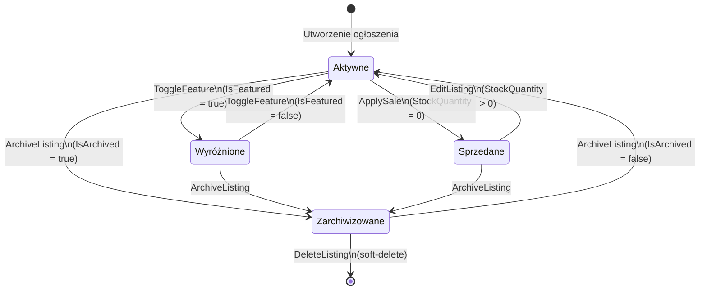
```mermaid
stateDiagram-v2
    [*] --> Aktywne : Utworzenie ogłoszenia

    Aktywne --> Sprzedane : ApplySale\n(StockQuantity = 0)
    Aktywne --> Zarchiwizowane : ArchiveListing\n(IsArchived = true)
    Aktywne --> Wyróżnione : ToggleFeature\n(IsFeatured = true)

    Wyróżnione --> Aktywne : ToggleFeature\n(IsFeatured = false)
    Wyróżnione --> Zarchiwizowane : ArchiveListing

    Sprzedane --> Aktywne : EditListing\n(StockQuantity > 0)
    Sprzedane --> Zarchiwizowane : ArchiveListing

    Zarchiwizowane --> Aktywne : ArchiveListing\n(IsArchived = false)
    Zarchiwizowane --> [*] : DeleteListing\n(soft-delete)
```

---

## 6. Diagram stanów — Zamówienie (Order)

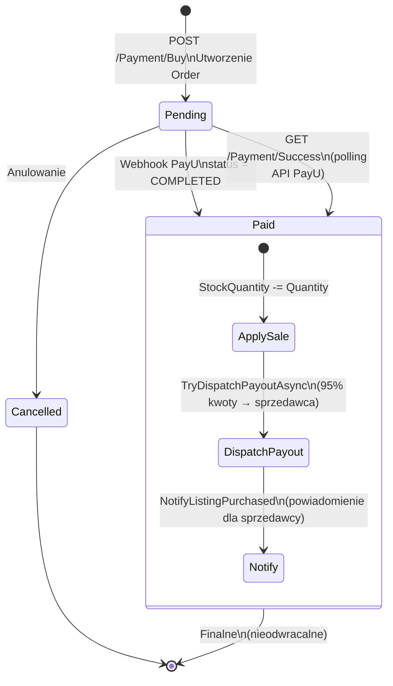
```mermaid
stateDiagram-v2
    [*] --> Pending : POST /Payment/Buy\nUtworzenie Order

    Pending --> Paid : Webhook PayU\nstatus = COMPLETED
    Pending --> Paid : GET /Payment/Success\n(polling API PayU)
    Pending --> Cancelled : Anulowanie

    Paid --> [*] : Finalne\n(nieodwracalne)
    Cancelled --> [*]

    state Paid {
        [*] --> ApplySale : StockQuantity -= Quantity
        ApplySale --> DispatchPayout : TryDispatchPayoutAsync\n(95% kwoty → sprzedawca)
        DispatchPayout --> Notify : NotifyListingPurchased\n(powiadomienie dla sprzedawcy)
    }
```

---

## 7. Diagram stanów — Propozycja wymiany (TradeProposal)

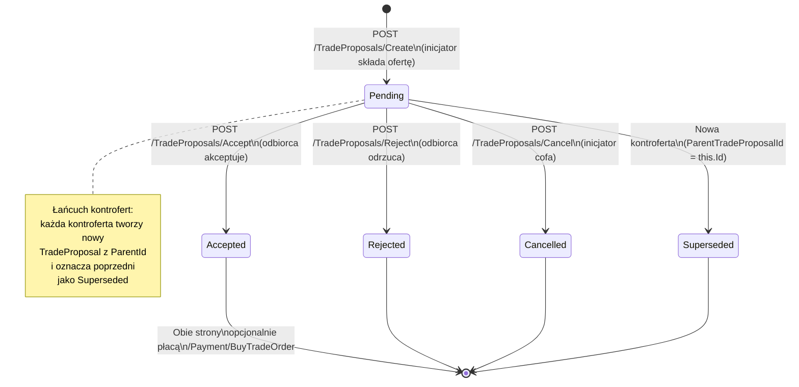
```mermaid
stateDiagram-v2
    [*] --> Pending : POST /TradeProposals/Create\n(inicjator składa ofertę)

    Pending --> Accepted : POST /TradeProposals/Accept\n(odbiorca akceptuje)
    Pending --> Rejected : POST /TradeProposals/Reject\n(odbiorca odrzuca)
    Pending --> Cancelled : POST /TradeProposals/Cancel\n(inicjator cofa)
    Pending --> Superseded : Nowa kontroferta\n(ParentTradeProposalId = this.Id)

    Accepted --> [*] : Obie strony\nopcjonalnie płacą\n/Payment/BuyTradeOrder
    Rejected --> [*]
    Cancelled --> [*]
    Superseded --> [*]

    note right of Pending
        Łańcuch kontrofert:
        każda kontroferta tworzy nowy
        TradeProposal z ParentId
        i oznacza poprzedni
        jako Superseded
    end note
```

---

## 8. Diagram stanów — Karta sprzedawcy (SellerCard)

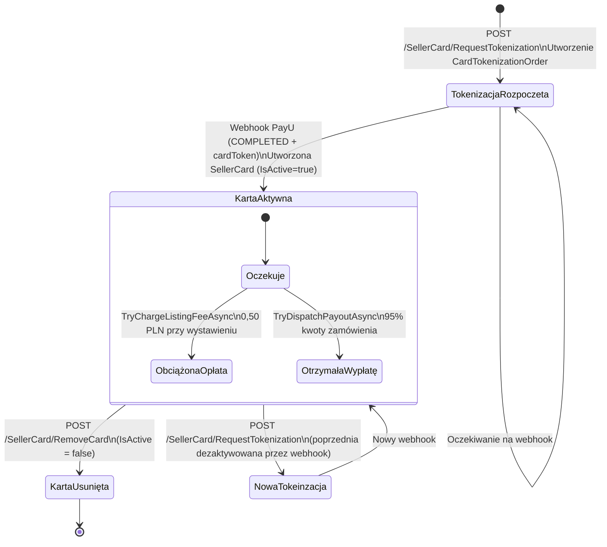
```mermaid
stateDiagram-v2
    [*] --> TokenizacjaRozpoczeta : POST /SellerCard/RequestTokenization\nUtworzenie CardTokenizationOrder

    TokenizacjaRozpoczeta --> KartaAktywna : Webhook PayU (COMPLETED + cardToken)\nUtworzona SellerCard (IsActive=true)
    TokenizacjaRozpoczeta --> TokenizacjaRozpoczeta : Oczekiwanie na webhook

    KartaAktywna --> KartaUsunięta : POST /SellerCard/RemoveCard\n(IsActive = false)
    KartaAktywna --> NowaTokeinzacja : POST /SellerCard/RequestTokenization\n(poprzednia dezaktywowana przez webhook)

    KartaUsunięta --> [*]
    NowaTokeinzacja --> KartaAktywna : Nowy webhook

    state KartaAktywna {
        [*] --> Oczekuje
        Oczekuje --> ObciążonaOpłata : TryChargeListingFeeAsync\n0,50 PLN przy wystawieniu
        Oczekuje --> OtrzymałaWypłatę : TryDispatchPayoutAsync\n95% kwoty zamówienia
    }
```

---

## 9. Diagram stanów — Wypłata (SellerPayout)

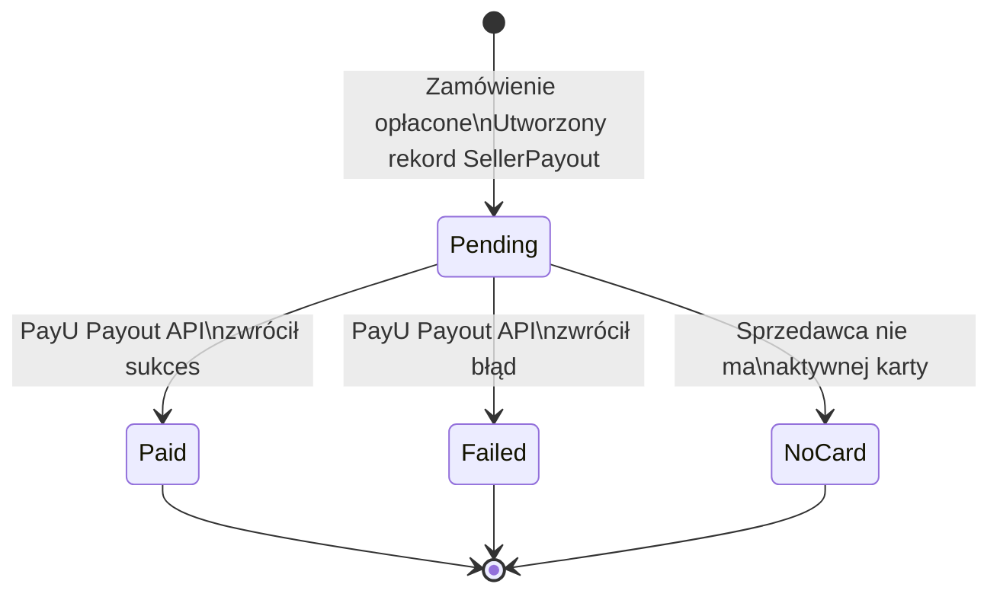
```mermaid
stateDiagram-v2
    [*] --> Pending : Zamówienie opłacone\nUtworzony rekord SellerPayout

    Pending --> Paid : PayU Payout API\nzwrócił sukces
    Pending --> Failed : PayU Payout API\nzwrócił błąd
    Pending --> NoCard : Sprzedawca nie ma\naktywnej karty

    Paid --> [*]
    Failed --> [*]
    NoCard --> [*]
```

---

## 10. Diagram stanów — Zgłoszenie (Ticket)

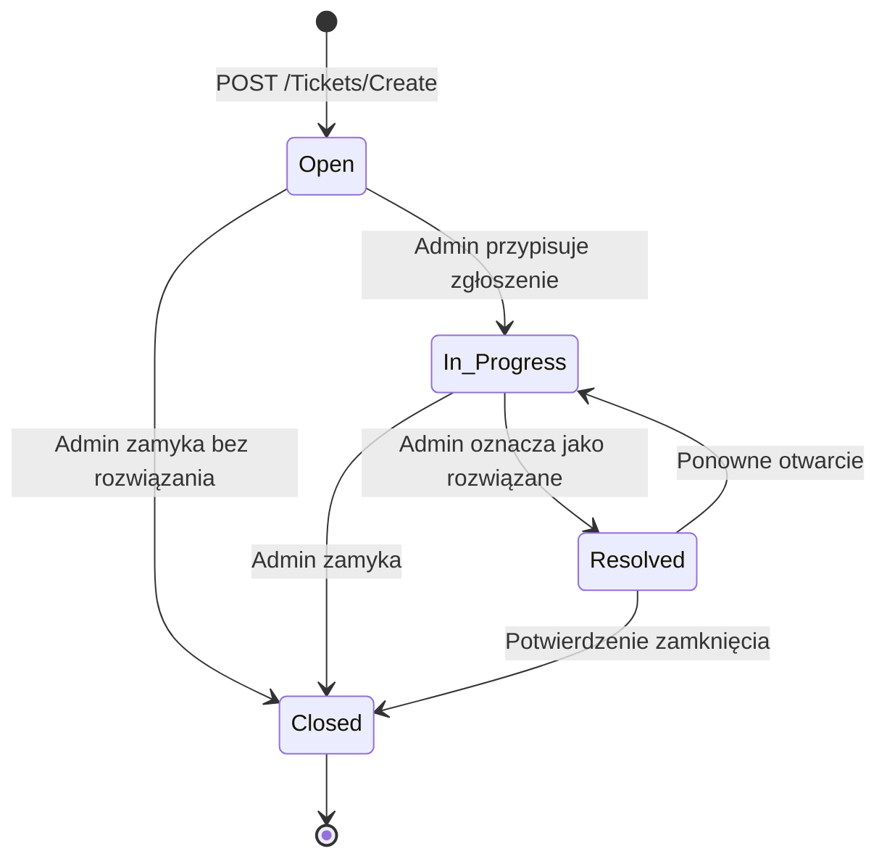
```mermaid
stateDiagram-v2
    [*] --> Open : POST /Tickets/Create

    Open --> In_Progress : Admin przypisuje zgłoszenie
    Open --> Closed : Admin zamyka bez rozwiązania

    In_Progress --> Resolved : Admin oznacza jako rozwiązane
    In_Progress --> Closed : Admin zamyka

    Resolved --> Closed : Potwierdzenie zamknięcia
    Resolved --> In_Progress : Ponowne otwarcie

    Closed --> [*]
```

---

## 11. Diagram sekwencji — Zakup ogłoszenia

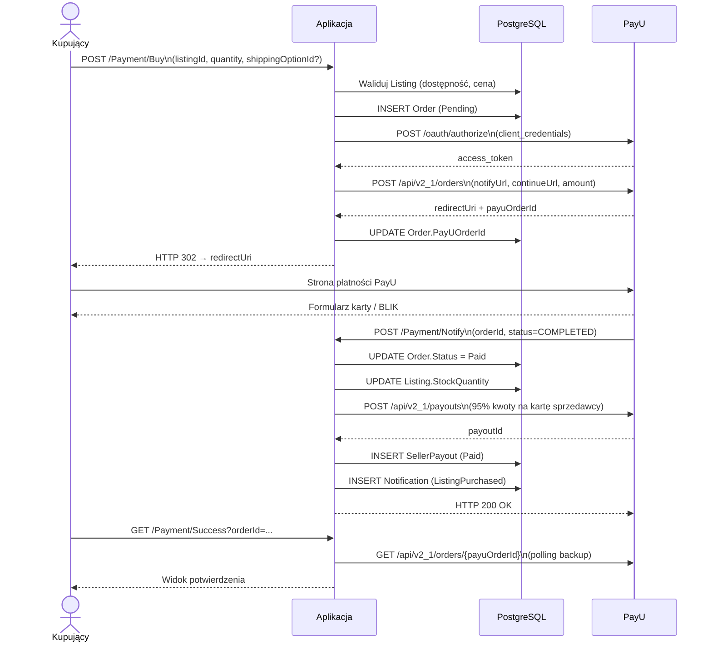
```mermaid
sequenceDiagram
    actor Kupujący
    participant App as Aplikacja
    participant DB as PostgreSQL
    participant PayU

    Kupujący->>App: POST /Payment/Buy\n(listingId, quantity, shippingOptionId?)
    App->>DB: Waliduj Listing (dostępność, cena)
    App->>DB: INSERT Order (Pending)
    App->>PayU: POST /oauth/authorize\n(client_credentials)
    PayU-->>App: access_token
    App->>PayU: POST /api/v2_1/orders\n(notifyUrl, continueUrl, amount)
    PayU-->>App: redirectUri + payuOrderId
    App->>DB: UPDATE Order.PayUOrderId
    App-->>Kupujący: HTTP 302 → redirectUri

    Kupujący->>PayU: Strona płatności PayU
    PayU-->>Kupujący: Formularz karty / BLIK

    PayU->>App: POST /Payment/Notify\n(orderId, status=COMPLETED)
    App->>DB: UPDATE Order.Status = Paid
    App->>DB: UPDATE Listing.StockQuantity
    App->>PayU: POST /api/v2_1/payouts\n(95% kwoty na kartę sprzedawcy)
    PayU-->>App: payoutId
    App->>DB: INSERT SellerPayout (Paid)
    App->>DB: INSERT Notification (ListingPurchased)
    App-->>PayU: HTTP 200 OK

    Kupujący->>App: GET /Payment/Success?orderId=...
    App->>PayU: GET /api/v2_1/orders/{payuOrderId}\n(polling backup)
    App-->>Kupujący: Widok potwierdzenia
```

---

## 12. Diagram sekwencji — Tokenizacja karty płatniczej

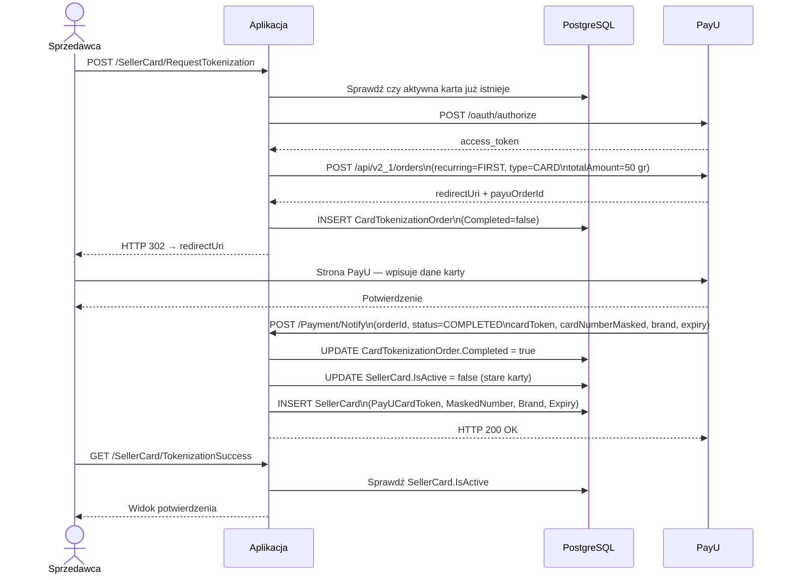
```mermaid
sequenceDiagram
    actor Sprzedawca
    participant App as Aplikacja
    participant DB as PostgreSQL
    participant PayU

    Sprzedawca->>App: POST /SellerCard/RequestTokenization
    App->>DB: Sprawdź czy aktywna karta już istnieje
    App->>PayU: POST /oauth/authorize
    PayU-->>App: access_token
    App->>PayU: POST /api/v2_1/orders\n(recurring=FIRST, type=CARD\ntotalAmount=50 gr)
    PayU-->>App: redirectUri + payuOrderId
    App->>DB: INSERT CardTokenizationOrder\n(Completed=false)
    App-->>Sprzedawca: HTTP 302 → redirectUri

    Sprzedawca->>PayU: Strona PayU — wpisuje dane karty
    PayU-->>Sprzedawca: Potwierdzenie

    PayU->>App: POST /Payment/Notify\n(orderId, status=COMPLETED\ncardToken, cardNumberMasked, brand, expiry)
    App->>DB: UPDATE CardTokenizationOrder.Completed = true
    App->>DB: UPDATE SellerCard.IsActive = false (stare karty)
    App->>DB: INSERT SellerCard\n(PayUCardToken, MaskedNumber, Brand, Expiry)
    App-->>PayU: HTTP 200 OK

    Sprzedawca->>App: GET /SellerCard/TokenizationSuccess
    App->>DB: Sprawdź SellerCard.IsActive
    App-->>Sprzedawca: Widok potwierdzenia
```

---

## 13. Diagram sekwencji — Propozycja wymiany

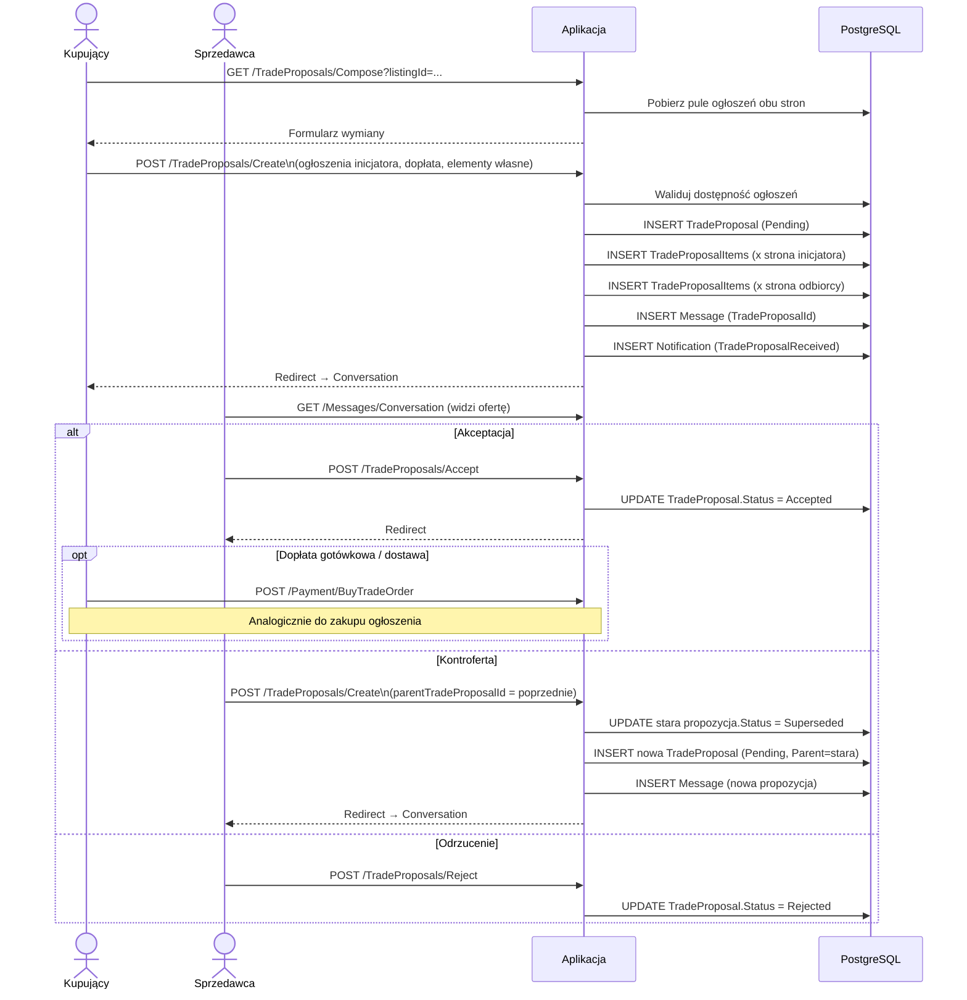
```mermaid
sequenceDiagram
    actor Kupujący
    actor Sprzedawca
    participant App as Aplikacja
    participant DB as PostgreSQL

    Kupujący->>App: GET /TradeProposals/Compose?listingId=...
    App->>DB: Pobierz pule ogłoszeń obu stron
    App-->>Kupujący: Formularz wymiany

    Kupujący->>App: POST /TradeProposals/Create\n(ogłoszenia inicjatora, dopłata, elementy własne)
    App->>DB: Waliduj dostępność ogłoszeń
    App->>DB: INSERT TradeProposal (Pending)
    App->>DB: INSERT TradeProposalItems (x strona inicjatora)
    App->>DB: INSERT TradeProposalItems (x strona odbiorcy)
    App->>DB: INSERT Message (TradeProposalId)
    App->>DB: INSERT Notification (TradeProposalReceived)
    App-->>Kupujący: Redirect → Conversation

    Sprzedawca->>App: GET /Messages/Conversation (widzi ofertę)

    alt Akceptacja
        Sprzedawca->>App: POST /TradeProposals/Accept
        App->>DB: UPDATE TradeProposal.Status = Accepted
        App-->>Sprzedawca: Redirect

        opt Dopłata gotówkowa / dostawa
            Kupujący->>App: POST /Payment/BuyTradeOrder
            Note over Kupujący,App: Analogicznie do zakupu ogłoszenia
        end

    else Kontroferta
        Sprzedawca->>App: POST /TradeProposals/Create\n(parentTradeProposalId = poprzednie)
        App->>DB: UPDATE stara propozycja.Status = Superseded
        App->>DB: INSERT nowa TradeProposal (Pending, Parent=stara)
        App->>DB: INSERT Message (nowa propozycja)
        App-->>Sprzedawca: Redirect → Conversation

    else Odrzucenie
        Sprzedawca->>App: POST /TradeProposals/Reject
        App->>DB: UPDATE TradeProposal.Status = Rejected
    end
```

---

## 14. Diagram sekwencji — Wystawienie ogłoszenia z opłatą

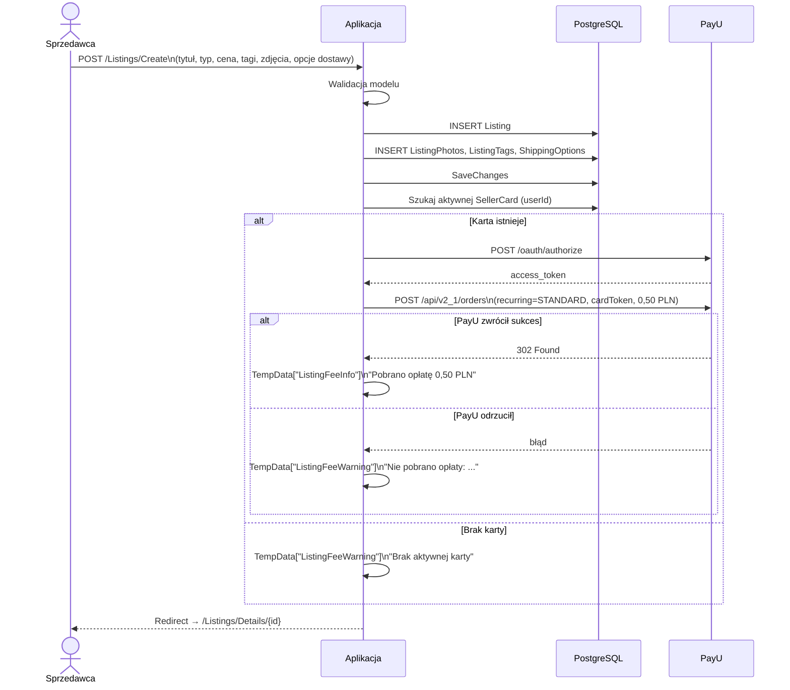
```mermaid
sequenceDiagram
    actor Sprzedawca
    participant App as Aplikacja
    participant DB as PostgreSQL
    participant PayU

    Sprzedawca->>App: POST /Listings/Create\n(tytuł, typ, cena, tagi, zdjęcia, opcje dostawy)
    App->>App: Walidacja modelu
    App->>DB: INSERT Listing
    App->>DB: INSERT ListingPhotos, ListingTags, ShippingOptions
    App->>DB: SaveChanges

    App->>DB: Szukaj aktywnej SellerCard (userId)

    alt Karta istnieje
        App->>PayU: POST /oauth/authorize
        PayU-->>App: access_token
        App->>PayU: POST /api/v2_1/orders\n(recurring=STANDARD, cardToken, 0,50 PLN)
        alt PayU zwrócił sukces
            PayU-->>App: 302 Found
            App->>App: TempData["ListingFeeInfo"]\n"Pobrano opłatę 0,50 PLN"
        else PayU odrzucił
            PayU-->>App: błąd
            App->>App: TempData["ListingFeeWarning"]\n"Nie pobrano opłaty: ..."
        end
    else Brak karty
        App->>App: TempData["ListingFeeWarning"]\n"Brak aktywnej karty"
    end

    App-->>Sprzedawca: Redirect → /Listings/Details/{id}
```

---

## 15. Diagram przepływu danych — System powiadomień

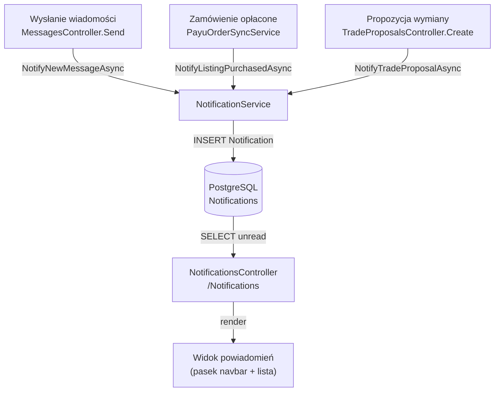
```mermaid
flowchart TD
    E1["Wysłanie wiadomości\nMessagesController.Send"] -->|NotifyNewMessageAsync| NS
    E2["Zamówienie opłacone\nPayuOrderSyncService"] -->|NotifyListingPurchasedAsync| NS
    E3["Propozycja wymiany\nTradeProposalsController.Create"] -->|NotifyTradeProposalAsync| NS

    NS["NotificationService"] -->|INSERT Notification| DB[(PostgreSQL\nNotifications)]

    DB -->|SELECT unread| NC["NotificationsController\n/Notifications"]
    NC -->|render| View["Widok powiadomień\n(pasek navbar + lista)"]
```